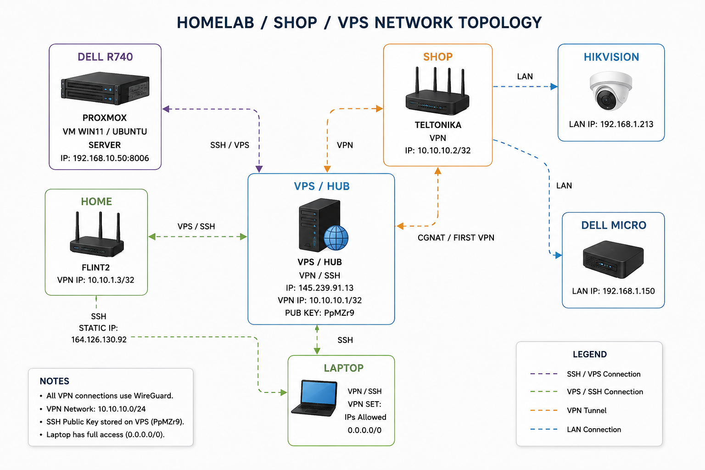

# General Map

This section provides an overview of my HomeLab infrastructure.

## Infrastructure Diagram

## Network Topology

## Hardware Overview

### Server
- Dell PowerEdge R740
- Proxmox VE
- RAID storage
- iDRAC Enterprise

### Laptop
- Dell Latitude 7490
- Ubuntu 24.04 LTS

### Routers
- GL.iNet Flint 2
- Teltonika RUT955

### Single-board computer
- Raspberry Pi 5
- Ubuntu Server

### Network devices
- Dell Micro PC
- IP Camera
- Smart Plug

### Virtual Machines
- Ubuntu Server
- Ubuntu Desktop
- Windows Server
- Windows 11

## Learning Roadmap

*Coming soon...*
